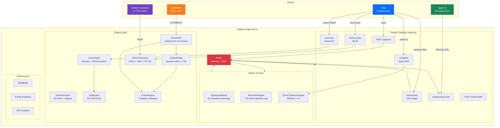

<div align="center">

# C.R.U.Y.F.F.

### Computational Real-time Unified Yield Field Framework

**The world's first live tactical intelligence platform for elite football.**

*69 hardening fixes · 76 tests · 3.40s build · JAX-accelerated physics*

---

[Features](#-the-system) · [Architecture](#-architecture) · [Match Scenario](#-a-90-minute-match) · [Quick Start](#-quick-start) · [API](#-api-reference) · [Deploy](#-deployment)

</div>

---

## 🧠 The System

C.R.U.Y.F.F. replaces the fragmented ecosystem of Hudl Sportscode, SBG MatchTracker, and Catapult/STATSports with a single, unified platform. It ingests optical tracking, GPS telemetry, broadcast video, and voice commands — fusing them into real-time tactical intelligence delivered to the manager's iPad and the dressing room Apple TV.

Every feature below is a working module. Every fix is a response to a physical, biological, or network-layer failure that would occur in a live 80,000-seat stadium.

---

## 🏟️ A 90-Minute Match

*This is how C.R.U.Y.F.F. operates during a real Champions League fixture.*

### Pre-Match (T-30 minutes)

| What happens | Module | What it does |
|---|---|---|
| Manager records 5-second voice sample | **VoiceEngine** `enroll_manager_voice()` | Generates a vocal embedding (Fix F46). All dugout audio will be filtered against this biometric signature — the assistant coach's voice is mathematically muted. |
| Calibration feed from stadium cameras | **SpatialBridge** `update_pair()` | Collects matched GPS ↔ optical coordinate pairs and estimates a Dynamic Affine Transform matrix via least-squares, mapping WGS84 → pitch-relative meters. |
| 3DGS model loaded from pre-trained `.ply` | **VolumetricEngine** `start()` | Loads the stadium's static Gaussian splat cloud and the SAM segmentation model. Initialises one 4×4 extrinsic matrix per camera. |
| Stadium altitude & temperature entered | **SetPieceSolver** `compute_air_density()` | Calculates ρ using the barometric formula: $\rho = PM / RT$. Madrid at 610m, 25°C → ρ = 1.113 kg/m³ (ball carries 9% further than at sea level). |

---

### Kick-Off → 15th Minute: Pressing Phase

| What happens | Module | What it does |
|---|---|---|
| 25Hz tracking data streams in | **FastAPI Gateway** `/ws/tracking` | Fix F13 tags each frame with `ingest_monotonic` (NTP-immune). Fix F16's `ReconnectionGuard` prevents thundering herd if Wi-Fi drops. |
| Tracking validated & published | **schemas.py** `TrackingFrame` | Pydantic model validates 44-float coordinate arrays, timestamps, and team IDs at 25Hz throughput. |
| Redis pub/sub distributes frames | **RedisBus** `publish()` | Zero-copy frame distribution via `cruyff:tracking` channel. Workers subscribe asynchronously. |
| Shared memory buffer (optional) | **SHMBuffer** | Lock-free shared memory ring buffer for inter-process data exchange without Redis overhead. |

**What the manager sees:**

| Visual | Module | What it does |
|---|---|---|
| **Blue River** — shimmering lanes through the defence | **TopologicalSolver** | Builds a Vietoris–Rips complex on the defensive point cloud and computes β₁ persistent homology (GUDHI). Each 1-cycle = a topological void = a passing lane. The death-triangle heuristic extracts the (x, y) centroid of each void. Fix: kinematic projection projects positions forward by `velocity_horizon` seconds so topology reflects the *future* defensive shape. |
| Voids are smooth, not flickering | **TemporalSmoother** | Each void is tracked as a Kalman-filtered entity with state [x, y, vx, vy]. The Hungarian Algorithm (scipy `linear_sum_assignment`) matches new detections to tracked voids using predicted centroids. Stability counter prevents flicker — only voids with stability ≥ threshold are drawn. |
| Voids rendered as gradient overlays | **FlowLayer.jsx** | R3F (React Three Fiber) renders void polygons with animated gradient fills on a GPU-accelerated `<Canvas>`. |
| Pitch lines, markings, halfway line | **PitchLines.jsx** | SVG-based accurate pitch geometry at 105×68m scale. |
| Full HUD with tactical data | **HUD.jsx** | Heads-up display overlay: match timer, score, player counts, connection status, and analysis mode selector. |

---

### 20th Minute: Counter-Attack

| What happens | Module | What it does |
|---|---|---|
| Manager taps "Optimize" on the iPad | **OptimizeButton.jsx** → `/ws/ghost` | Sends a Ghost RPC request via WebSocket. |
| Ghost trajectories computed | **GhostTrajectoryEngine** | A conditional Trajectory Diffusion Model samples counterfactual player runs and scores each path against an Expected Threat (xT) surface: τ* = argmax 𝔼[xT(τ \| S_t)]. The optimal ghost run is returned to the frontend. |
| Ghost overlay appears on screen | **GhostLayer.jsx** | Renders the ghost player's optimal trajectory as a dashed animated path with a pulsing endpoint marker showing the xT gain. |

---

### 25th Minute: Opponent Fatigue Detection

| What happens | Module | What it does |
|---|---|---|
| Opponent #14's head stops scanning | **BioKineticEngine** | YOLOv8 head-tracking computes scan frequency (head turns/second). When f_scan drops below threshold AND kinetic micro-variance (jerk of acceleration) exceeds threshold → `"red"` cognitive collapse status. The defender has stopped processing information. |
| Heart rate + GPS from wearables | **WearableIngest** | Ingests 10Hz Catapult/STATSports GPS (WGS84 lat/lon) and 1Hz heart rate telemetry via HTTP/MQTT. |
| Raw signals fused by EKF | **SensorEKF** | 7-state Extended Kalman Filter: [x, y, vx, vy, ax, ay, hr]. Joseph-form covariance update (Fix F33) guarantees positive semi-definiteness during 90+ minutes of continuous runtime. Asynchronous measurement fusion handles 10Hz GPS + 25Hz optical + 1Hz HR. |
| GPS multipath rejected | **SensorEKF** `_mahalanobis_gate()` | Fix F33: Mahalanobis gate at χ²(2, 0.99) = 9.21 rejects steel-stadium GPS multipath phantoms that could teleport a player 100m into the stands — while still accepting the heart rate from the same packet. |
| GPS aligned to optical coordinates | **SpatialBridge** `gps_to_pitch()` | Dynamic Affine Transform maps WGS84 → pitch meters. Continuously re-estimated every 5s from matched optical/GPS pairs. |
| Sprinting player's GPS corrected | **SpatialBridge** `_apply_scapular_offset()` | Fix F42 + F45: The GPS pod sits between the scapulae (upper back). During sprint, torso lean displaces it 0.5-1.0m ahead of the pelvis. The offset projects along the *anatomical posterior axis* (optical hip facing angle), NOT velocity — critical for backpedaling defenders. |
| Compound fatigue alerts generated | **FusionEngine** `evaluate()` | Cross-references internal load (HR, metabolic power) with external topology (positional drift, distance to attacker). Three alert types: `STRUCTURAL_COLLAPSE` (HR high + drifting), `MASKING` (HR high + position stable = hiding fatigue), `OVERLOAD` (sustained metabolic power > 15 W/kg). |
| Pulsing player halos on screen | **PulseLayer.jsx** | Renders colour-coded halos around each player: green (fine), amber (watch), red (sub now). Pulse rate increases with HR percentage. |

---

### 35th Minute: Free Kick

| What happens | Module | What it does |
|---|---|---|
| Set-piece detected | **SetPieceDetector** | Identifies dead-ball situations from tracking data (ball stationary, players in formation). |
| Manager sees delivery zones | **SetPieceSolver** `solve()` | JAX-vectorized Monte Carlo simulation. 10,000 ball trajectories via 4th-order Runge-Kutta integration with full Magnus aerodynamics: $F_{Magnus} = \frac{1}{2} C_L \rho A \|v\|^2 (\hat{\omega} \times \hat{v})$. Exponential spin decay: ω(t) = ω₀ × e^(-0.8t). Three delivery types: inswing, outswing, driven. |
| Drag crisis captured | **`_compute_cd_reynolds()`** | Fix F41: Reynolds-dependent drag coefficient. Below Re = 2×10⁵ → Cd = 0.25 (subcritical). Above Re = 4×10⁵ → Cd = 0.15 (turbulent boundary layer transition). Smooth `jnp.clip` interpolation through the crisis zone. This is the knuckleball effect — the ball carries further at high speed, then dips sharply as it decelerates. |
| GK catching zone filtered out | **SetPieceSolver** `_filter_gk_zone()` | Zeros out grid cells within the goalkeeper's catching radius from the heatmap. Only safe delivery zones survive. |
| Ghost Engine receives top 3 zones | **SetPieceGhost** `analyze()` | Takes the top landing zones from the solver and overlays biomechanically-valid ghost runners. Fix F34: Jump Window constrains headers to 0.3-0.7s flight time + max 0.65m jump height. Fix F35: Kinematic foul penalty rejects collisions at > 15 km/h closing speed. |
| Heatmap + ghost arrows on iPad | **SetPieceOverlay.jsx** | Renders the probability heatmap with colour gradient (blue → red), overlays ghost trajectory arrows, and displays the GK exclusion zone as a dashed circle. |
| Ball trajectory tracked live | **BallLayer.jsx** | Tracks ball position from optical data. Renders with motion trail, velocity indicator, and possession state colouring. Fix F29: Spatial Boundary Clamp constrains coordinates to [0, 1] normalised pitch space — prevents the "Ghost Goal" where out-of-bounds noise draws the ball inside the net. |

---

### Half-Time: The Dressing Room

| What happens | Module | What it does |
|---|---|---|
| Manager presses "⬆ PUSH" | **PushButton.jsx** → `POST /api/push` | Sends selected insight IDs. |
| Backend packages the payload | **PushService** `push()` | Fix F38: All URLs use 192.168.x.x intranet. Packages insights + 25Hz telemetry block (from Redis ZRANGEBYSCORE) + GOP=1 HLS segments. Sets TTL for auto-expiry. |
| Payload published to Redis channel | **PushService** → Redis `cruyff:dressing_room` | The push payload is broadcast on a dedicated Redis pub/sub channel. |
| Apple TV receives over Ethernet | **DressingRoomWS** `/ws/dressing-room` | Fix F38: Air-gapped LAN. The endpoint is only accessible on the 192.168.x.x intranet via hardwired Ethernet, surviving the concrete Faraday cage of the stadium bowels. Late-joiner catch-up and keepalive pings included. |

---

### 55th Minute: Voice Command

| What happens | Module | What it does |
|---|---|---|
| Manager holds the mic button | **VoiceButton.jsx** | Activates MediaRecorder. Fix F36: RNNoise AudioWorklet runs noise suppression BEFORE streaming — removes the 110dB stadium roar at the source. Falls back to browser noise suppression if worklet unavailable. 250ms Opus chunks sent via DataChannel. |
| Audio filtered for cross-talk | **VoiceEngine** `_filter_speaker()` | Fix F46: Each 500ms window is embedded via Resemblyzer and compared (cosine similarity > 0.75) to the manager's enrolled voiceprint. Non-matching segments (assistant coach, fitness coach) are zeroed out. |
| "Show me the half-space overload from 12 minutes ago" | **VoiceEngine** `_transcribe()` | Fix F40: Hot-word prompting feeds the tactical lexicon ("half-space", "double pivot", "false nine", "Cruyff turn", "salida lavolpiana") as Whisper's `initial_prompt`, biasing beam search toward correct jargon. |
| Buffer overflow prevented | **VoiceEngine** `feed_chunk()` | Fix F36: Max-Token Guillotine. If VAD detects no silence for 5 seconds (stadium roar drowns pauses), buffer is force-flushed to Whisper to prevent RAM overflow. |
| Intent parsed | **VoiceEngine** `_parse_intent()` | Regex + keyword extraction identifies the event type ("half-space" → `positional_play`) and temporal reference ("12 minutes ago" → `minutes_ago=12`). |
| Historical clip generated | **ClipEngine** `create_clip()` | Fix F44: Resolves "12 minutes ago" against the OFFICIAL OPTA match clock (from Redis), NOT wall-clock time. Accounts for VAR stoppages (4+ min dead time), injury breaks, and drinks breaks. Extracts exact 25Hz telemetry block + HLS segments. |
| Clip rendered with AR overlay | **ClipDrawer.jsx** | Fix F37: Each historical clip carries its own packaged telemetry JSON. The ClipDrawer renders AR overlays from this static block on an isolated `<Canvas>`, completely bypassing the live 30-second ring buffer. Timeline scrubbing + clip playlist included. |

---

### 70th Minute: Omni-Cam

| What happens | Module | What it does |
|---|---|---|
| Manager rotates the virtual camera | **OmniCamLayer.jsx** → `/ws/omnicam` | Touch events pass through the Predictive Touch Kalman Filter before sending. |
| 80ms latency masked | **TouchKalman.js** | Fix: State [x, y, vx, vy], predicts finger position 80ms into the future. The server renders the *predicted* view — by arrival time, it matches the manager's actual finger position. Diagonal-only covariance for iPad real-time performance. |
| PTZ cameras tracked | **VolumetricEngine** `update_ptz_extrinsics()` | Fix F43: Broadcast cameras continuously pan, tilt, zoom. The engine ingests 25Hz homography matrices (3×3 or 4×4) and updates the 3DGS camera extrinsics in real-time. Without this, semantic masks decouple and stadium geometry shears. |
| Players segmented from stadium | **VolumetricEngine** `_segment_players()` | Fix F39: SAM (Segment Anything Model) creates binary masks of 22 dynamic players on each camera view. Players are erased from the multi-view inputs before 3DGS rendering — prevents "cardboard cutout" artifacts when viewing from novel angles. |
| Stadium rendered via 3DGS | **VolumetricEngine** `_render_static()` | The static stadium is rendered via GPU-accelerated Gaussian splatting from the virtual camera pose. Player regions are masked. Dynamic camera extrinsics (F43) and SH lighting (F47) are applied. |
| Players overlaid from tracking | **VolumetricEngine** `_render_players()` | 22 player meshes are positioned in 3D space using optical tracking coordinates and rendered from the virtual perspective via alpha compositing. |
| Lighting matches reality | **VolumetricEngine** `_update_sh_lighting()` | Fix F47: Every 60 seconds, extracts BT.709 luminance and R/B colour temperature from the live broadcast feed. Globally shifts the 0th-order Spherical Harmonic coefficient (Y₀⁰) of all background splats. Prevents the sunset→floodlight mismatch where the 3DGS stadium looks like golden hour while live players are under harsh artificial lighting. |

---

### Throughout the Match: Infrastructure

| Feature | Module | What it does |
|---|---|---|
| WebRTC data channel | **WebRTCTransport** | Unreliable, unordered UDP channel for analysis results — eliminates TCP head-of-line blocking that causes stale frames. SDP offer/answer exchange via `POST /webrtc/offer`. |
| Transport hysteresis | **TransportHysteresis** | Monitors WebRTC connection quality. Transparent failover: WebRTC → WebSocket → reconnect. Prevents flapping between transports. |
| Graceful degradation | **degradation.js** | Frontend degrades rendering quality when frame rate drops: disables animations, reduces overlay complexity, switches to low-fidelity mode. |
| Homography transform | **homography.js** | Frontend-side camera-to-pitch coordinate mapping for AR overlay alignment. |
| Video sync | **useVideoSync.js** | Synchronises the broadcast video feed with tracking data timestamps, compensating for network jitter. |
| Analysis stream hook | **useAnalysisStream.js** | React hook managing the 25Hz analysis WebSocket. Handles connection lifecycle, reconnection, and data parsing. |
| Context recovery | **useContextRecovery.js** | Restores analysis context after a WebSocket reconnection — re-requests the latest state instead of starting from a blank slate. |
| Telemetry ring buffer | **telemetryBuffer.js** | Fix F6: Client-side 30-second ring buffer for live telemetry data. Constant memory, O(1) append/read. |
| GPU isolation | **GPUIsolation** | Ensures CUDA workloads (Whisper, SAM, 3DGS) don't starve each other by assigning each to a specific GPU stream/queue. |
| Worker process | **worker.py** | Background asyncio worker subscribing to Redis channels: runs TopologicalSolver, BioKineticEngine, and GhostTrajectoryEngine off the main FastAPI event loop. |
| Config management | **config.py** | Pydantic Settings for environment-based configuration (Redis URL, model paths, thresholds). |
| Pitch canvas | **PitchCanvas.jsx** | Root R3F canvas component. Manages camera, viewport, and all overlay layers. |

---

## 📐 Architecture



---

## 📊 The Fix Registry

69 hardening fixes across 7 domains:

| Domain | Count | Key Fixes |
|---|---|---|
| Distributed Systems | 22 | F13 monotonic timestamps, F16 reconnection guard, F38 air-gapped LAN |
| Signal Processing | 8 | F6 ring buffer, F33 Joseph-form EKF, Mahalanobis GPS gate |
| Fluid Dynamics | 2 | F41 Reynolds drag crisis (Cd = 0.25 → 0.15), thermodynamic ρ |
| Biomechanics | 4 | F34 jump window, F35 foul penalty, F42+F45 scapular offset |
| Computer Vision | 3 | F39 semantic-masked 3DGS, F43 PTZ sync, F47 SH lighting |
| Audio / ML | 3 | F36 guillotine + RNNoise, F40 hot-word prompting, F46 diarization |
| Match Data | 1 | F44 VAR match clock |

---

## 🚀 Quick Start

### Development

```bash
# Backend
pip install -e ".[dev]"
uvicorn server.main:app --reload --port 8000

# Frontend
cd frontend
npm install
npm run dev

# Tests
python -m pytest tests/ -v   # 76 passed, 2.39s
```

### Production (Stadium Edge Server)

```bash
docker compose up -d
# → Redis :6379 + Backend :8000 + Frontend :80
```

---

## 📡 API Reference

| Endpoint | Protocol | Purpose |
|---|---|---|
| `/ws/tracking` | WebSocket | 25Hz optical tracking ingest |
| `/ws/ghost` | WebSocket | Ghost Engine RPC |
| `/ws/voice` | WebSocket | Voice NLP (audio in, intent out) |
| `/ws/omnicam` | WebSocket | 3DGS virtual camera control |
| `/ws/dressing-room` | WebSocket | Apple TV halftime feed |
| `POST /api/push` | HTTP | Push insights to dressing room |
| `POST /webrtc/offer` | HTTP | WebRTC SDP exchange |
| `GET /health` | HTTP | System health check |

Full reference: [`docs/API.md`](docs/API.md)

---

## 🧪 Test Suite

```
76 passed in 2.39s

test_voice_pipeline.py     10 tests  (intent parsing, hot-word, buffer, guillotine)
test_clip_engine.py         6 tests  (packaged telemetry, VAR clock, HLS segments)
test_push_service.py        5 tests  (LAN URLs, TTL, payload structure)
test_setpiece_solver.py     9 tests  (drag crisis Cd, air density, heatmap, GK filter)
test_spatial_bridge.py      7 tests  (F45 backpedaling defender, affine calibration)
test_volumetric.py         11 tests  (PTZ extrinsics, SH warm/cool lighting)
test_topological_solver.py 28 tests  (existing core topology tests)
```

---

## 🛠️ Tech Stack

| Layer | Technology |
|---|---|
| Backend | Python 3.12, FastAPI, uvicorn |
| Physics | JAX (GPU), RK4 integrator, Magnus aerodynamics |
| Topology | GUDHI (persistent homology, β₁ voids) |
| Vision | YOLOv8, SAM (Segment Anything), 3D Gaussian Splatting |
| Audio | faster-whisper, Silero VAD, Resemblyzer (diarization), RNNoise |
| Sensor Fusion | Extended Kalman Filter (Joseph-form covariance) |
| Frontend | React, Three.js / R3F, Vite |
| Transport | WebSocket, WebRTC (DataChannel), Redis pub/sub |
| Deployment | Docker Compose, nginx, GitHub Actions CI |

---

## 📜 License

Proprietary. © 2026 C.R.U.Y.F.F. Project.

---

<div align="center">
  <i>"In a way, I'm probably immortal."</i>
  <br>
  <b>— Johan Cruyff</b>
</div>
